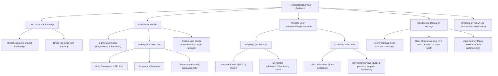
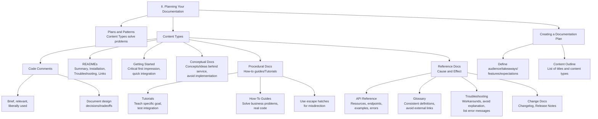
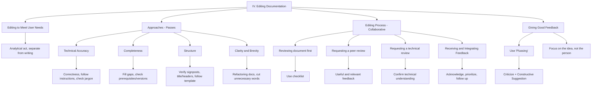
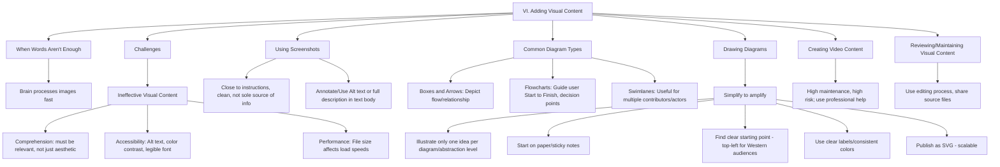
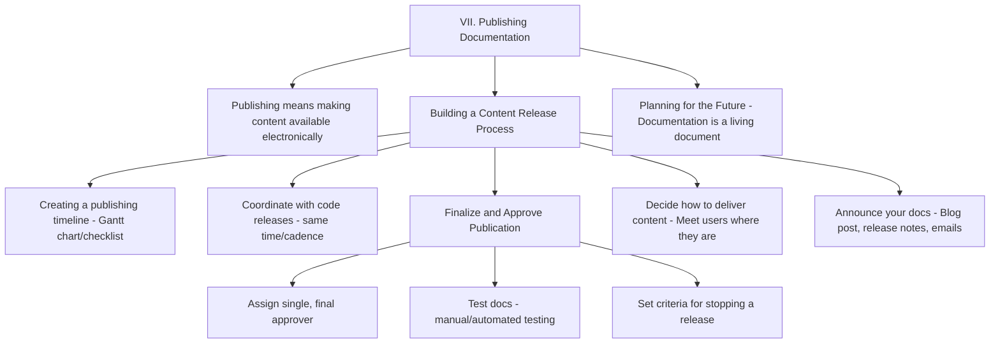
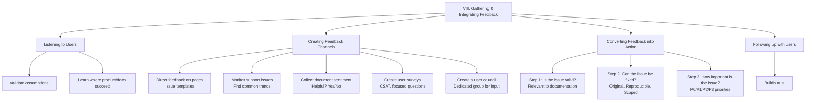

# `[DRAFT]` Workflow for Writing Tech Docs & Tutorials

Written with 💖 by Rakesh Asapanna

- Professional Experience: [asra.dev](https://asra.dev/)
- GitHub: [@rozeappletree](https://github.com/rozeappletree)
- LinkedIn: [in/asapanna-rakesh](https://www.linkedin.com/in/asapanna-rakesh/)

 

## Introduction: Establishing Documentation as an Engineering Discipline

https://github.com/user-attachments/assets/28f7d3de-f973-4ff5-a14c-f8155a8c0da7

Great documentation is an often-overlooked yet critical component for the success and large-scale adoption of any software project. It is not an afterthought or the final, rushed step in a release plan, but an integral feature of the software itself—often the very first feature a user interacts with. When documentation is clear, accurate, and helpful, it builds trust, accelerates onboarding, and empowers users. When it is missing or inaccurate, it becomes a primary source of friction, frustration, and disengagement.
This guide reveals the repeatable, end-to-end process for creating and managing high-value technical documentation, framing it as a core engineering discipline. Just as developers refine their code through a "developer loop" of writing, testing, and iterating, technical writers and documentarians follow an analogous "writer loop." This process requires understanding the user's problem, creating a plan to solve it, using established patterns, and writing content that provides a clear solution.
By treating documentation with the same rigor and process-oriented mindset as software development, teams can transform it from a liability into a powerful asset. This guide will walk you through the four major phases of that professional lifecycle:
1. **Foundation and Planning:** Understanding your users and architecting a content plan to meet their needs.
2. **Content Creation and Authoring:** Drafting text and integrating essential code samples and visuals.
3. **Quality Assurance and Release:** Refining content through a structured editing and review process before publishing.
4. **Lifecycle Management:** Gathering feedback, measuring quality, and maintaining the documentation's integrity over time.

## Principle Elements / Steps Involved in Doc Workflow

Principle 11 steps detailing the documentation workflow:

1. **Understanding your audience:** This involves breaking the "curse of knowledge" by performing user research to identify users' goals, who they are, and their needs, often condensing findings into personas, user stories, and friction logs.
2. **Planning your documentation:** This step involves translating the empathy gained from user research into action by determining which content types—such as READMEs, conceptual documentation, or procedural documentation—best address user needs, culminating in a comprehensive documentation plan.
3. **Drafting documentation:** Focuses on confronting the blank page by defining the document's goal and title, creating an outline, and filling in content using paragraphs, lists, and callouts while striving for simplicity and clarity.
4. **Editing documentation:** This is the analytical act of reviewing text to ensure it meets user needs, focusing on technical accuracy, completeness, structure, clarity, and brevity, often through a collaborative peer review process.
5. **Integrating code samples:** Recognizing that code is critical to developers, this step covers providing code samples that are explained, concise, clear, usable, and trustworthy, often exploring tooling options like testing or autogenerating samples.
6. **Adding visual content:** Addresses using visuals, such as screenshots and diagrams (boxes and arrows, flowcharts, swimlanes), to convey information quickly and effectively, while ensuring accessibility and maintaining minimal clutter.
7. **Publishing documentation:** Involves building a content release process, aligning the publishing timeline with code releases, deciding how to deliver content to meet users where they are, and announcing the documentation's availability.
8. **Gathering and integrating feedback:** Details establishing scalable feedback channels—like monitoring support issues or creating user surveys—and establishing a triage process to convert user feedback into prioritized, actionable tasks.
9. **Measuring documentation quality:** Focuses on defining "quality" by assessing functional quality (does it fulfill its purpose?) and structural quality (is it well-written?) and using a strategy of clustered metrics (like TTHW or unique visitors) to evaluate success.
10. **Organizing documentation:** Involves establishing the information architecture—using combinations of sequences, hierarchies, and webs—to help readers build a mental map of the content, often utilizing navigation cues and landing pages.
11. **Maintaining and deprecating documentation:** Covers planning for ongoing maintenance, assigning document owners, automating toil (e.g., freshness checks and linters), and correctly deprecating or deleting content that is no longer useful or accurate

  
---

## I. Understanding Your Audience

Understanding your audience is the first and most essential step in the documentation creation process. This step focuses on establishing empathy for users, which is required to write effective documentation.

The core objective of this initial phase is to overcome the _"curse of knowledge,"_ a cognitive bias where writers assume others possess the same knowledge they do. This curse can lead to using jargon or omitting crucial information.

Here are the key components of this phase, designed to break the curse of knowledge and set users on the path to success:

- **Creating an Initial Sketch of Your Users:** To write effectively, writers must first understand who their users are and what they want to achieve.
- **Define User Goals:** Research is guided by understanding what users want to accomplish by reading the documentation. Documentation must align with both the engineering goal (what the user wants) and the business goal (what the organization wants).
- **Understand User Identity:** Users can be defined by their role (e.g., developers, product managers), level of experience (e.g., junior developers), or the situation they are in (e.g., using documentation at 4 a.m. after a pager alert). Because not every user's needs can be met, writers must prioritize the users most important for the product or business.
- **Outline User Needs:** This involves listing the specific questions documentation must answer, ranging from general (e.g., "How do I get started?") to product-specific (e.g., "How do I authenticate against your API?"). During research, the distinction between user wants (e.g., a sports car) and user needs (e.g., a bus ticket) must be identified.
Validating User Understanding (User Research)
The initial sketch of users, goals, and needs must be validated through user research.
- **Existing Data Sources:** Support tickets are considered a "gold mine" for understanding user needs, as they reveal what frustrated users require most. Other organizational teams like developer relations, product support, UX, and marketing can also provide valuable insights. Support issues should be grouped by themes, such as topic, process, or user type, to identify patterns.
- **Collecting New Data:** If existing data is insufficient, new data can be collected through direct interviews and developer surveys.
  - **Direct Interviews:** These are used to "dig a little deeper" into pressing issues, emphasizing quality over quantity of participants. Interviews should use specific, open questions (questions that elicit stories and detailed explanations) rather than closed, yes-or-no questions.
  - **Developer Surveys:** These provide actionable and immediate insights from a large group but must be quick, painless, and focused on targeted, closed questions.
Condensing and Applying Findings
Research results must be condensed into tangible records for use in subsequent writing stages.
- **User Personas:** These are semi-fictional characters representing the ideal reader, compiling essential characteristics like developer skill, languages, environment, and role. Personas help the writer focus on the users who need the most help, such as junior developers.
- **User Stories:** These are short summaries of what a user is trying to achieve, following the format: "As a [type of user], I want [activity] so that I can [goal]".
- **User Journey Maps:** These are diagrams illustrating the path a user takes through a product to accomplish a task, highlighting points of happiness or areas for improvement.
- **Friction Log:** A journal where the developer uses the software as a newcomer would, recording the difference between expected and actual behavior at each sequential step. Noticing "friction" (frustration, anger) helps identify opportunities to improve documentation or the product itself. 

## II. Planning Your Documentation

- Understand the content types and patterns that best serve your users, this will help us create a documentation plan.
- A documentation plan functions as a flexible outline, making it easy to map out a user journey through the content you write.
- A good plan helps you anticipate and meet your user’s needs for information.
- The plan allows you to coordinate writing, organizing, and publishing your documentation with other stakeholders.
- A plan helps identify gaps and shortcomings not just within your documentation, but across the entire user journey for your service.
- If you start writing documentation before creating a plan, you might miss critical information your users need or overlook problems they are trying to solve.
- To build your documentation plan, you should answer questions like identifying your target audience and listing the most important features being released.
- Answering these crucial questions creates context and allows you to decide what content to build.
- You should begin planning your documentation with a content outline.
- Your content outline should list the titles for the pages you need to write and each page’s corresponding content type.
- If your documentation plan reflects a coherent journey for your users, you are likely in good shape.
- If the plan feels like a maze or if a user’s path to accomplishing a task is unclear, you should go back and reshape the documentation plan.
- You should get feedback from others on your documentation plan before you begin the writing stage.
- Once the documentation plan is complete, you can begin listing additional items your documentation needs, such as integrating code samples or visual content.

## III. Drafting Documentation

```mermaid
graph TD
    A[III. Drafting Documentation]
    
    A --> B[Set up for Success]
    A --> C[Define Title and Goal]
    A --> D[Create Outline]
    A --> E[Drafting Content Elements]
    A --> F[Writing for Skimming]
    A --> G[Getting Unstuck]
    A --> H[Working from Templates]
    
    B --> B1[Use familiar tools]
    
    C --> C1[Shortest, clearest<br/>rephrasing of purpose]
    
    D --> D1[List all steps/parts<br/>of concept]
    D --> D2[Order must meet reader's<br/>expectations/needs]
    
    E --> E1[Headers]
    E --> E2[Paragraphs]
    E --> E3[Procedures]
    E --> E4[Lists]
    E --> E5[Callouts]
    
    E1 --> E1A[Signposts, brief,<br/>unique, consistent]
    E2 --> E2A[Context, limit to<br/>5 sentences or fewer]
    E3 --> E3A[Numbered lists, one action<br/>per step, verification]
    E4 --> E4A[Group related info,<br/>skimmable, order helpfully]
    E5 --> E5A[Warning, Caution, Note;<br/>highlight critical info]
    
    F --> F1[State most important<br/>info first<br/>first 3 paragraphs]
    F --> F2[Break up large blocks<br/>of text<br/>subheaders, lists, visuals]
    F --> F3[Break up long documents<br/>by audience/topic/feature]
    F --> F4[Strive for simplicity<br/>and clarity<br/>concise docs are beautiful]
    
    G --> G1[Ask for help, highlight<br/>missing content,<br/>write out of sequence]
    
    H --> H1[Consistent structure/format]
```

## IV. Editing Documentation

## V. Integrating Code Samples

```mermaid
graph TB
    Root["V. Integrating Code Samples"]
    
    Root --> Importance["Code samples are critical<br/>(developers seek code)"]
    
    Root --> Types["Types of Samples"]
    Types --> Executable["Executable<br/>(runnable, copy/paste)"]
    Types --> Explanatory["Explanatory<br/>(output, error code, non-runnable)"]
    
    Root --> Principles["Principles of Good Samples"]
    Principles --> Explained["Explained<br/>(prerequisites, intent, match output)"]
    Principles --> Concise["Concise<br/>(essential info only, short lines, use ellipsis)"]
    Principles --> Clear["Clear<br/>(Refactor if complex, follow style conventions)"]
    Principles --> Usable["Usable/Extensible<br/>(Descriptive strings for replacement data)"]
    Principles --> Trustworthy["Trustworthy<br/>(Production-ready, test regularly)"]
    
    Root --> Design["Designing Samples"]
    Design --> Language["Choosing a language<br/>(primary user language)"]
    Design --> Complexity["Highlighting complexity range<br/>(hello world to complex examples)"]
    Design --> Presentation["Presentation<br/>(Visually distinct, fixed-width font)"]
    
    Root --> Tooling["Tooling"]
    Tooling --> Testing["Testing code samples<br/>(store in repo, run tests)"]
    Tooling --> Sandboxing["Sandboxing code<br/>(allows safe interaction)"]
    Tooling --> Autogen["Autogenerating samples<br/>(human input/review still needed)"]
    
```

## VI. Adding Visual Content

## VII. Publishing Documentation

## VIII. Gathering & Integrating Feedback

## IX. Measuring Documentation Quality

```mermaid
graph TD
    A[Measuring Documentation Quality] --> B[Core Principle]
    A --> C[Functional Quality]
    A --> D[Structural Quality]
    A --> E[Analytics Strategy]
    A --> F[Tips for Using Metrics]
    
    B --> B1[A document is good when<br/>it fulfills its purpose]
    
    C --> C1[Does it work?]
    C1 --> C2[Accessible]
    C1 --> C3[Purposeful]
    C1 --> C4[Findable]
    C1 --> C5[Accurate]
    C1 --> C6[Complete]
    
    C2 --> C2A[Language & Reading Level]
    C2 --> C2B[WCAG Compliance]
    
    C3 --> C3A[States Goal Clearly]
    C3 --> C3B[Measures Time to Hello World]
    
    C4 --> C4A[Site Architecture]
    C4 --> C4B[Search Keywords]
    C4 --> C4C[Deep Navigation]
    
    C5 --> C5A[Correct & Up-to-date]
    C5 --> C5B[Working Code Samples]
    
    C6 --> C6A[All Prerequisites Included]
    C6 --> C6B[All Tasks Covered]
    C6 --> C6C[Next Steps Provided]
    
    D --> D1[Is it well-written?]
    D1 --> D2[Clear]
    D1 --> D3[Concise]
    D1 --> D4[Consistent]
    
    D2 --> D2A[Easy to Understand]
    D2 --> D2B[Well-ordered Headers]
    D2 --> D2C[No Jargon]
    
    D3 --> D3A[Brief but Comprehensive]
    D3 --> D3B[Remove Unnecessary Words]
    
    D4 --> D4A[Structure]
    D4 --> D4B[Concepts]
    D4 --> D4C[Word Choice]
    
    E --> E1[Align Goals]
    E1 --> E2[Organizational Goals]
    E1 --> E3[User Goals]
    E1 --> E4[Documentation Goals]
    
    E2 --> E2A[Adoption]
    E2 --> E2B[Retention]
    E2 --> E2C[Cost Reduction]
    
    E3 --> E3A[Specific Task Completion]
    
    E4 --> E4A[Unique Visitors]
    E4 --> E4B[Time to Hello World]
    E4 --> E4C[Bounce Rate]
    E4 --> E4D[Link Validation]
    
    F --> F1[Make a Plan]
    F --> F2[Establish a Baseline]
    F --> F3[Consider Context]
    F --> F4[Use Clusters of Metrics]
    F --> F5[Mix Feedback Types]
    
    F1 --> F1A[Why Measure?]
    F1 --> F1B[What Will You Do?]
    
    F2 --> F2A[Compare Changes Over Time]
    
    F3 --> F3A[Error Codes vs Getting Started]
    F3 --> F3B[High Page Views Have Different Meanings]
    
    F4 --> F4A[Better Answers Than Single Metric]
    
    F5 --> F5A[Qualitative Feedback]
    F5 --> F5B[Quantitative Feedback]
```

